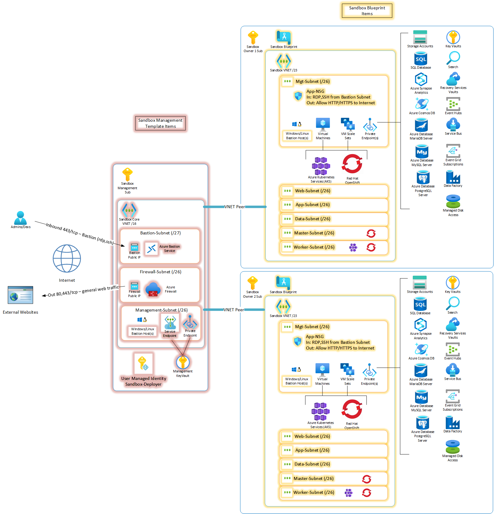

# Sandbox Management and Landing Zone
This solution deploys a Sandbox management and landing zone environment.  It is recommended this be deployed after the CAF Enterprise Scale Architecture and into the "Sandboxes" management group.  The management solution is deploy only once and includes the required connectivity and security components to allow access into the environment.  After the management subscription is configured deploy additional subscriptions under the Sandbox management group for each sandbox Landing Zone environment you wish to deploy.  The landing zone is configured using a custom Azure Blueprint which can be locked to prevent sandbox users from chaning the default connectivity configuration while allowing access to deploy required resources.  The diagram depicts the Sandbox solution.

# Instructions
1. Create a new subscription for Sandbox Management under the Sandboxes Management Group (see CAF Enterprise Scale Architecture).  Create a new Resource Group called "sandbox-management" in the subscription and deploy the sandbox-management.json ARM template to it.  The Key Vault name must be unique from any other Key Vaults in Azure.
2. The Sandbox Management template creates a new User Defined Managed Identity called Sandbox-Deployer and automatically gives it rights to access the KeyVault.  This account must also be given "Owner" rights to the Sandbox Management Subscription.
3. Deploy the Sandbox Blueprint.
4. Create a new subscription for a Sandbox Landing zone.  Grant the Sandbox-Deployer managed identity from above owner rights to the subscription.  Assign the Sandbox Blueprint to the subscription.