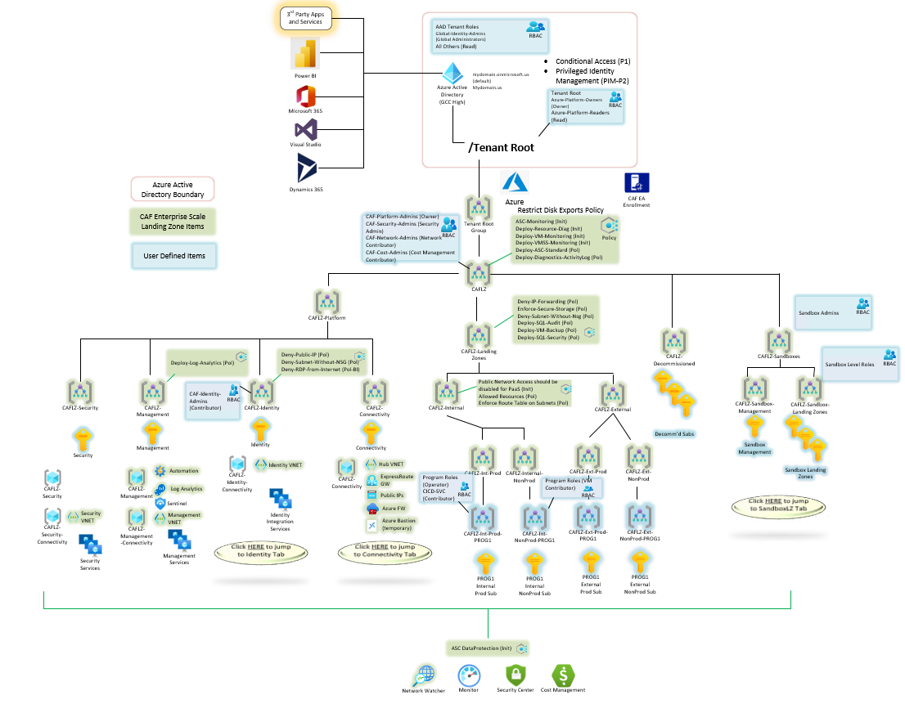

# Deploy Enterprise-Scale with VNET Hub and Spoke Architecture

The Enterprise-Scale architecture is modular by design and allow organizations to start with foundational landing zones that support their application portfolios and add hybrid connectivity with ExpressRoute or VPN when required. Alternatively, organizations can start with an Enterprise-Scale architecture based on the traditional hub and spoke network topology if customers require hybrid connectivity to on-premises locations from the begining.  



## Please NOTE this is a Custom Solution Repository
The orginal source for this solution can be found on GitHub at https://github.com/Azure/Enterprise-Scale/tree/main/docs/reference/adventureworks.  The version contained in this repository includes a cloned copy of the original templates, as well as an added set of CICD script and template files for use by DevOps teams to customize the solution and make the deployment repeatable in their environment.  It also includes modifications for deployment of the template in Microsoft Azure Government (MAG).

# Deployment Instructions

1. Create an App Registration and Service Princpal to use for Deploying the Enterprise Scale Landing Zone

This can be done in the Azure Portal by creating a new App Registration in the Azure Active Directory blade.  When creating the app registration this way and service principal is created automatically for you (see Enterprise Applications).

You can create these programatically using Power Shell or Azure CLI

2. Assign Owner Rights to the Service Principal or alternatively to a group in which the service principal is a member.
```
Get-AzRoleAssignment | where {$_.Scope -eq "/"}
New-AzRoleAssignment -ObjectId <user/group object id> -Scope "/" -RoleDefinitionName Owner
```

# List of Modifications from Original Templates
## Changes required for MAG
The templates must be modified from their original source to deploy successfully to MAG as described at:
* [Deploy Enterprise Scale Landing Zone from CICD Pipeline in MAG](../README.md)

## Management Group Updates
The management group hierarchy declared in **mgmtGroups.json** has been modified as follows:

        Tenant Root Group
            CAF (Root)
                CAF-Platform
                    CAF-Management
                    CAF-Identity
                    CAF-Connectivity
                CAF-LandingZones
                    CAF-Intranet
                        CAF-Program1
                        CAF-Program2
                        CAF-Program3
                    CAF-Extranet
                CAF-Decomissioned
                CAF-Sandboxes
                    CAF-Sandbox-Management
                    CAF-Sandbox-LandingZones

## Policy Definitions
The following Policy Definitions have been added/modified in **policies.json**:
* **Enforce-Subn-RouteTable** Enforce Route Table on All Subnets. Takes the following parameters:
  
        RouteTableResourceGroup (Default: Locked)
        RouteTableName (Default: RouteTable)

* **Deploy-AzureBackup-on-VM** Deploys if not exist a backup vault in the resourcegroup of  the virtual machine and enabled the backup for the virtual machine with defaultPolicy enabled.

## Landing Zone Policy Assignments
The policy assignments have been added/modified in a new template file called **lz.json**:
* **Deploy-VM-Backup** Deploys if not exist a backup vault in the resourcegroup of  the virtual machine and enabled the backup for the virtual machine with defaultPolicy enabled at **CAF-LandingZone** MG Scope. 

## Intranet Landing Zone Policy Assignments
The policy assignments have been added/modified in a new template file called **intranetlz.json**:
* **Deny-Intranet-Public-PaaS-Endpoints** Public network access should be disabled for PAAS services (Initiative) assigned at **CAF-Intranet** MG Scope.  This policy applies to the following PaaS Services:  
  
        Cosmos
        MariaDB
        MySQL
        PostgreSQL
        KeyVault
        SqlServer
        Storage
        AKS

* **Allowed-Intranet-Resource-Types** Allowed resource types (Policy) assigned at **CAF-Intranet** MG Scope.  The following Services are allowed:
        
        Microsoft.Compute (All)

* **Enforce-Subn-RouteTable** Enforce Route Table on All Subnets assigned at **CAF-Intranet** MG Scope.
