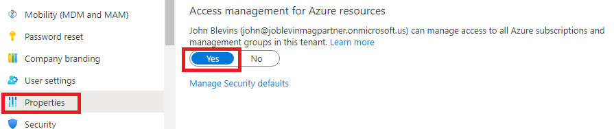

# Deploy Enterprise-Scale with VNET Hub and Spoke Architecture

The Enterprise-Scale architecture is modular by design and allow organizations to start with foundational landing zones that support their application portfolios and add hybrid connectivity with ExpressRoute or VPN when required. Alternatively, organizations can start with an Enterprise-Scale architecture based on the traditional hub and spoke network topology if customers require hybrid connectivity to on-premises locations from the begining.  


## Please NOTE this is a Custom Solution Repository
The orginal source for this solution can be found on GitHub at https://github.com/Azure/Enterprise-Scale/tree/main/docs/reference/adventureworks.  The version contained in this repository includes a cloned copy of the original templates, as well as an added set of CICD script and template files for use by DevOps teams to customize the solution and make the deployment repeatable in their environment.  It also includes modifications for deployment of the template in Microsoft Azure Government (MAG).

# Deployment Instructions

1. Login to the Azure Portal with an account that is both an Azure Active Directory Global Administrator and EA Enrollment Account Owner.  In the Azure Active Directory blade select properties and then "Yes" for the option to enable "Access management for Azure resources", then click Save.



2. Launch a cloud shell in the Azure Portal and run the following script:

```
# Create Azure-Platform-Owners Azure AD Group
platOwnerGrp=$(az ad group create --display-name Azure-Platform-Owners --mail-nickname Azure-Platform-Owners --description "Members can Create EA Subs in the Default Management Group" --query objectId --output tsv)

# Create Azure-EA-Subscription-Creators Azure AD Group
subCreatorGrp=$(az ad group create --display-name Azure-EA-Subscription-Creators --mail-nickname Azure-EA-Subscription-Creators --description "Members can Create EA Subs in the Default Management Group" --query objectId --output tsv)

# Create Azure AD App Registration and Service Principal
appId=$(az ad app create --display-name "Azure-ENTLZ-Deployer" --query appId --output tsv)
az ad sp create --id $appId
objId=$(az ad sp show --id $appId --query objectId --output tsv)

# Add Service Principal to Groups
az ad group member add --group $platOwnerGrp --member-id $objId
az ad group member add --group $subCreatorGrp --member-id $objId

# Assign Azure-Platform-Owners Group Owner role to Tenant Root Group Scope
az role assignment create --role "Owner" --scope / --assignee $platOwnerGrp

# Get Enrollment Account ID and Name
enrAcctID=$(az billing enrollment-account list --query "[0].id" --output tsv) # /providers/Microsoft.Billing/enrollmentAccounts/xxxxxxxx-xxxx-xxxx-xxxx-xxxxxxxxxxxx
enrAcctName=$(az billing enrollment-account list --query "[0].name" --output tsv) # xxxxxxxx-xxxx-xxxx-xxxx-xxxxxxxxxxxx

# Assign Azure-EA-Subscription-Creators Group Owner Role to Enrollment Account Scope
az role assignment create --assignee $subCreatorGrp --role "Owner" --scope $enrAcctID
```
This step will create an app registration called "azure-entlz-deployer".  You'll need to manually generate a client secret and note the Tenant ID and App ID. 

3. Update CICD Pipeline Service Account to use the "azure-entlz-deployer" credential from the prior step.

4. Create Four Subscriptions for the following Functions

* Management
* Security
* Connectivity
* Identity

5. Update CICD Pipeline Variables Specific to the Environment

6. Deploy Pipeline


```
Get-AzRoleAssignment | where {$_.Scope -eq "/"}
New-AzRoleAssignment -ObjectId <user/group object id> -Scope "/" -RoleDefinitionName Owner
```

# List of Modifications from Original Templates
## Changes required for MAG
The templates must be modified from their original source to deploy successfully to MAG as described at:
* [Deploy Enterprise Scale Landing Zone from CICD Pipeline in MAG](../README.md)

## Management Group Updates
The management group hierarchy declared in **mgmtGroups.json** has been modified as follows:

        Tenant Root Group
            CAF (Root)
                CAF-Platform
                    CAF-Management
                    CAF-Identity
                    CAF-Connectivity
                CAF-LandingZones
                    CAF-Intranet
                        CAF-Program1
                        CAF-Program2
                        CAF-Program3
                    CAF-Extranet
                CAF-Decomissioned
                CAF-Sandboxes
                    CAF-Sandbox-Management
                    CAF-Sandbox-LandingZones

## Policy Definitions
The following Policy Definitions have been added/modified in **policies.json**:
* **Enforce-Subn-RouteTable** Enforce Route Table on All Subnets. Takes the following parameters:
  
        RouteTableResourceGroup (Default: Locked)
        RouteTableName (Default: RouteTable)

* **Deploy-AzureBackup-on-VM** Deploys if not exist a backup vault in the resourcegroup of  the virtual machine and enabled the backup for the virtual machine with defaultPolicy enabled.

## Landing Zone Policy Assignments
The policy assignments have been added/modified in a new template file called **lz.json**:
* **Deploy-VM-Backup** Deploys if not exist a backup vault in the resourcegroup of  the virtual machine and enabled the backup for the virtual machine with defaultPolicy enabled at **CAF-LandingZone** MG Scope. 

## Intranet Landing Zone Policy Assignments
The policy assignments have been added/modified in a new template file called **intranetlz.json**:
* **Deny-Intranet-Public-PaaS-Endpoints** Public network access should be disabled for PAAS services (Initiative) assigned at **CAF-Intranet** MG Scope.  This policy applies to the following PaaS Services:  
  
        Cosmos
        MariaDB
        MySQL
        PostgreSQL
        KeyVault
        SqlServer
        Storage
        AKS

* **Allowed-Intranet-Resource-Types** Allowed resource types (Policy) assigned at **CAF-Intranet** MG Scope.  The following Services are allowed:
        
        Microsoft.Compute (All)

* **Enforce-Subn-RouteTable** Enforce Route Table on All Subnets assigned at **CAF-Intranet** MG Scope.
