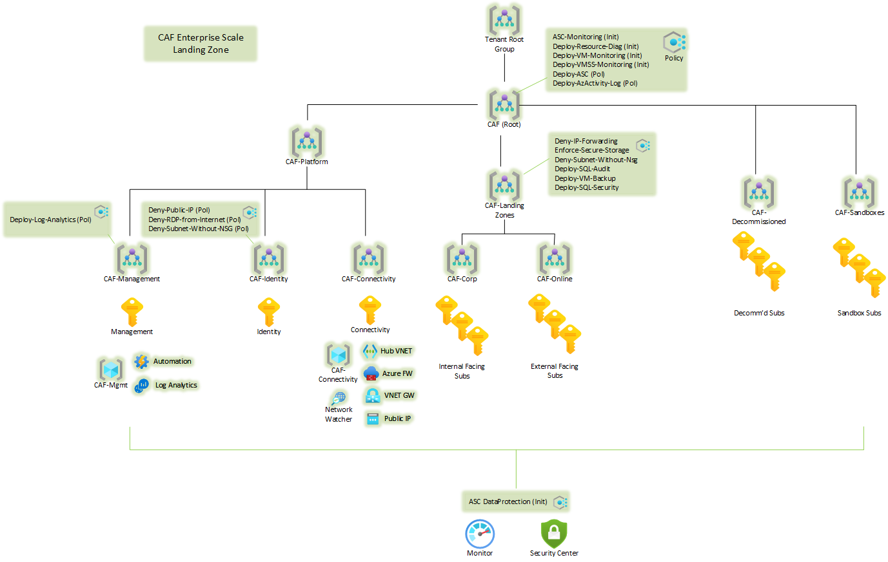

# Deploy Enterprise-Scale with hub and spoke architecture

The Enterprise-Scale architecture is modular by design and allow organizations to start with foundational landing zones that support their application portfolios and add hybrid connectivity with ExpressRoute or VPN when required. Alternatively, organizations can start with an Enterprise-Scale architecture based on the traditional hub and spoke network topology if customers require hybrid connectivity to on-premises locations from the begining.  

## Please NOTE this is a Custom Solution Repository
The orginal source for this solution can be found on GitHub at https://github.com/Azure/Enterprise-Scale/tree/main/docs/reference/adventureworks.  The version contained in this repository includes a cloned copy of the original templates, as well as an added set of CICD script and template files for use by DevOps teams to customize the solution and make the deployment repeatable in their environment.  It also includes modifications for deployment of the template in Microsoft Azure Government (MAG).

### Deviations from Original Solution for Microsoft Azure Government Deployment

In order to deploy the solution on Microsoft Azure Government the following Templates parameters must be configured as specified below:

#### Asc Configuration

The diagnosticsAndSecurity.json template attempts to enable Asc for AppServices and KeyVaults.  While these services are available in MAG, the Asc extensions for them are not.  As a result the following errors are received "The name 'AppServices' is not a valid name. Possible pricing bundle names: VirtualMachines, SqlServers, StorageAccounts, KubernetesService, ContainerRegistry." and "The name 'KeyVaults' is not a valid name. Possible pricing bundle names: VirtualMachines, SqlServers, StorageAccounts, KubernetesService, ContainerRegistry."

**Workaround 1 - Remove References to AppServices and KeyVaults in the diagnosticsAndSecurity.json Template File**

1.Remove the following code block:
    
    {
      "type": "Microsoft.Security/pricings",
      "apiVersion": "2018-06-01",
      "name": "AppServices",
      "dependsOn": [
        "[[concat('Microsoft.Security/pricings/StorageAccounts')]"
      ],
      "properties": {
        "pricingTier": "[[parameters('pricingTierAppServices')]"
      }
    },

2.Modify the following code block:

    {
      "type": "Microsoft.Security/pricings",
      "apiVersion": "2018-06-01",
      "name": "SqlServers",
      "dependsOn": [
        "[[concat('Microsoft.Security/pricings/AppServices')]"
      ],
      "properties": {
        "pricingTier": "[[parameters('pricingTierSqlServers')]"
      }
    },

as follows:

    {
      "type": "Microsoft.Security/pricings",
      "apiVersion": "2018-06-01",
      "name": "SqlServers",
      "dependsOn": [
        "[[concat('Microsoft.Security/pricings/StorageAccounts')]"
      ],
      "properties": {
        "pricingTier": "[[parameters('pricingTierSqlServers')]"
      }
    },

3.Remove the following code block from the template:
    {
      "type": "Microsoft.Security/pricings",
      "apiVersion": "2018-06-01",
      "name": "KeyVaults",
      "dependsOn": [
        "[[concat('Microsoft.Security/pricings/SqlServers')]"
      ],
      "properties": {
        "pricingTier": "[[parameters('pricingTierKeyVaults')]"
      }
    },
    
4.Modify the following code block:

    {
      "type": "Microsoft.Security/pricings",
      "apiVersion": "2018-06-01",
      "name": "KubernetesService",
      "dependsOn": [
        "[[concat('Microsoft.Security/pricings/KeyVaults')]"
      ],
      "properties": {
        "pricingTier": "[[parameters('pricingTierKubernetesService')]"
      }
    },

as follows:

    {
      "type": "Microsoft.Security/pricings",
      "apiVersion": "2018-06-01",
      "name": "KubernetesService",
      "dependsOn": [
        "[[concat('Microsoft.Security/pricings/SqlServers')]"
      ],
      "properties": {
        "pricingTier": "[[parameters('pricingTierKubernetesService')]"
      }
    },

**Workaround 2 - Disable Asc Free or Standard Tier Configuration in Parameters File**

In the template parameters file set the following:

    "enableAsc": {
      "value": "No"
    }

#### Disable Aks Policy in Template Parameters File

While AKS is available in MAG the lz.json template references Policy Definition ID /providers/Microsoft.Authorization/policyDefinitions/0a15ec92-a229-4763-bb14-0ea34a568f8d with name [Preview]: Azure Policy Add-on for Kubernetes service (AKS) should be installed and enabled on your clusters.  This Policy definition is not available in MAG.  The AKS policy can be enabled in the parameters file with no changes to any other template files.

**Disable Aks Policy**

    "enableAksPolicy": {
      "value": "No"
    }

#### Disable Arc Policy in Template Parameters File

While Arc is available in MAG the lz.json template references Policy Definition ID /providers/Microsoft.Authorization/policyDefinitions/69af7d4a-7b18-4044-93a9-2651498ef203 with name [Preview]: Deploy Log Analytics agent to Windows Azure Arc machines and /providers/Microsoft.Authorization/policyDefinitions/9d2b61b4-1d14-4a63-be30-d4498e7ad2cf with name [Preview]: Deploy Log Analytics agent to Linux Azure Arc machines.  These Policy definitions are not available in MAG.  The Arc policies can be disabled in the parameters file with no changes to any other template files.

**Disable Arc Monitoring**

    "enableArcMonitoring": {
      "value": "No"
    }

## Customer profile

This reference implementation is ideal for customers that have started their Enterprise-Scale journey with an Enterprise-Scale foundation implementation and then there is a need to add connectivity on-premises datacenters and branch offices by using a traditional hub and spoke network architecture. This reference implementation is also well suited for customers who want to start with Landing Zones for their net new
deployment/development in Azure by implementing a network architecture based on the traditional hub and spoke network topology.

## How to evolve from Enterprise-Scale foundation

If customer started with a Enterprise-Scale foundation deployment, and if the business requirements changes over time, such as migration of on-premise applications to Azure that requires hybrid connectivity, you will simply create the **Connectivity** Subscription, place it into the **Platform > Connectivity** Management Group and assign Azure Policy for the hub and spoke network topology.

## Pre-requisites

To deploy this ARM template, your user/service principal must have Owner permission at the Tenant root.
See the following [instructions](https://docs.microsoft.com/en-us/azure/role-based-access-control/elevate-access-global-admin) on how to grant access.  As well as https://github.com/Azure/Enterprise-Scale/blob/main/docs/EnterpriseScale-Setup-azure.md.

### Optional prerequisites

The deployment experience in Azure portal allows you to bring in existing (preferably empty) subscriptions dedicated for platform management, connectivity and identity. It also allows you to bring existing subscriptions that can be used as the initial landing zones for your applications.

To learn how to create new subscriptions programatically, please visit this [link](https://docs.microsoft.com/en-us/azure/azure-resource-manager/management/programmatically-create-subscription?tabs=rest).

To learn how to create new subscriptions using Azure portal, please visit this [link](https://azure.microsoft.com/en-us/blog/create-enterprise-subscription-experience-in-azure-portal-public-preview/).

## What will be deployed?

By default, all recommendations are enabled and you must explicitly disable them if you don't want it to be deployed and configured.

- A scalable Management Group hierarchy aligned to core platform capabilities, allowing you to operationalize at scale using centrally managed Azure RBAC and Azure Policy where platform and workloads have clear separation.
- Azure Policies that will enable autonomy for the platform and the landing zones.
- An Azure subscription dedicated for **management**, which enables core platform capabilities at scale using Azure Policy such as:
  - A Log Analytics workspace and an Automation account
  - Azure Security Center monitoring
  - Azure Security Center (Standard or Free tier)
  - Azure Sentinel
  - Diagnostics settings for Activity Logs, VMs, and PaaS resources sent to Log Analytics
- An Azure subscription dedicated for **connectivity**, which deploys core Azure networking resources such as:
  - A hub virtual network
  - Azure Firewall
  - ExpressRoute Gateway
  - VPN Gateway
  - Azure Private DNS Zones for Private Link
- (Optionally) An Azure subscription dedicated for **identity** in case your organization requires to have Active Directory Domain Controllers in a dedicated subscription.
- Landing Zone Management Group for **corp** connected applications that require connectivity to on-premises, to other landing zones or to the internet via shared services provided in the hub virtual network.
  - This is where you will create your subscriptions that will host your corp-connected workloads.
- Landing Zone Management Group for **online** applications that will be internet-facing, where a virtual network is optional and hybrid connectivity is not required.
  - This is where you will create your Subscriptions that will host your online workloads.
- Landing zone subscriptions for Azure native, internet-facing **online** applications and resources.
- Landing zone subscriptions for **corp** connected applications and resources, including a virtual network that will be connected to the hub via VNet peering.
- Azure Policies for online and corp-connected landing zones, which include:
  - Enforce VM monitoring (Windows & Linux)
  - Enforce VMSS monitoring (Windows & Linux)
  - Enforce Azure Arc VM monitoring (Windows & Linux)
  - Enforce VM backup (Windows & Linux)
  - Enforce secure access (HTTPS) to storage accounts
  - Enforce auditing for Azure SQL
  - Enforce encryption for Azure SQL
  - Prevent IP forwarding
  - Prevent inbound RDP from internet
  - Ensure subnets are associated with NSG

## Next steps

### From an application perspective:

Once you have deployed the reference implementation, you can create new subscriptions, or move an existing subscriptions to the **Landing Zones** > **Online** or **Corp**  management group, and finally assign RBAC to the groups/users who should use the landing zones (subscriptions) so they can start deploying their workloads.

Refer to the [Create Landing Zone(s)](../../EnterpriseScale-Deploy-landing-zones.md) article for guidance to create Landing Zones.
