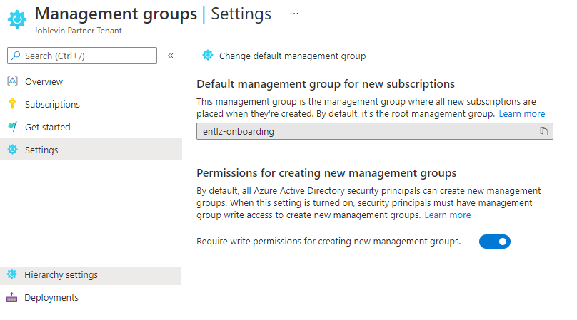
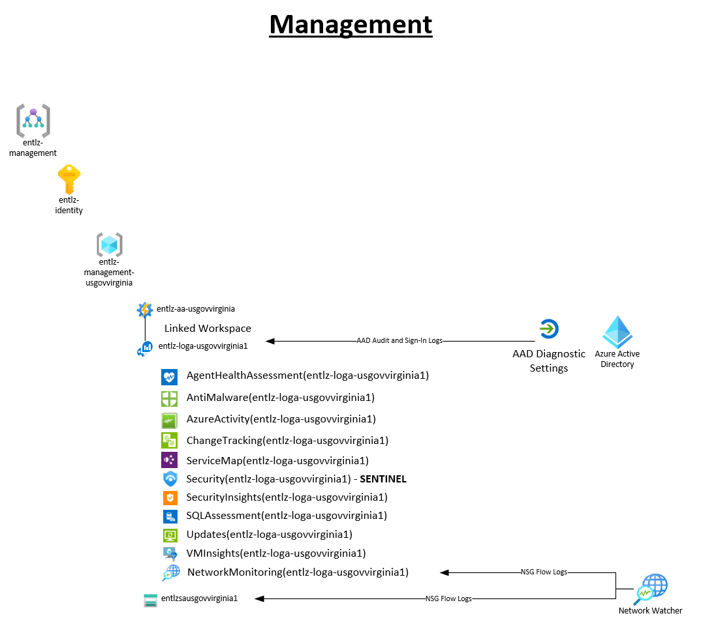

# Deploy Enterprise Landing Zone

The Enterprise Landing Zone architecture is modular by design and allows organizations to start with a foundational landing zone that provides the required governance, security and connectivity needed to support their application portfolios at scale in cloud.  A policy-based governance model is enforced that can be managed through Policy-as-Code and additional compliance frameworks can be layered on top of the base deployment where needed to meet security requirements.  The reference architecture allows for the deployment of either a VNET or VWAN based hub-and-spoke transit network model as well as support for enabling either ExpressRoute or VPN hybrid connetivity.  The architecture provides a scale mechanism for enabling mission owner workloads and can support multi-tenant, multi-region and multi-sovereign deployments.

The following diagram, available in the starter [Visio](visio/entlz.vsdx), depicts a fully deployed architecture using a VNET hub-and-spoke with ExpressRoute connectivity model:


The items highlighted in green are deployed using the automation in this solution.  This enables the enterprise scaffolding under which User Landing Zones are then deployed and managed.  The Subscription is the scale unit for deploying new user landing zones and included in this solution is automation to create new subscriptions and move them to the correct management group.  The following classes of User Landing Zones are available, with no required customization, within this framework:

* Internal - Workloads requiring internal organization connectivity with high security controls
    * Production - LOB Apps, Infrastructure, Internal Business Systems, etc...
    * Non-Production - Dev, Staging, Integration, etc...
* External - Workloads not requiring internal organization connectivity with moderate security controls
    * Production - Public Facing Websites, CDN, Media Services, etc...
    * Non-Production - Dev, Staging, Integration, etc...
* Sandbox - Workloads not requiring internal organization connectivity with complete isolation and low security controls
    * Sandbox - Training, Evaluation, Testing, Playground, etc...

When a user landing zone subscription is created and placed within the entperise scaffolding it inherits RBAC and Policies configured at the Management Group level.  In this fashion management is centralized, application owners are given more control over development agility and security guardrails are auto-enforced and traceable.

## Please NOTE this is a Custom Solution Repository
The reference implementation for this solution is based on the CAF enterprise scale landing zone templates which can be found on GitHub at https://github.com/Azure/Enterprise-Scale/tree/main/docs/reference/adventureworks.  The version contained in this repository includes updates to the original templates, as well as an added set of CICD pipeline templates for GitHub and GitLab deployments as well as converted BICEP template files for use by DevOps teams to customize the solution and make the deployment repeatable and more manageable in their environment.  It also includes modifications for deployment of the template in Microsoft Azure Government (MAG).

# Deploy the Enterprise Landing Zone
## Deployment Order
The Enterprise Landing Zone is deployed through a series of build/release pipline scripts packaged as GitHub actions (GitLab scripts included as well).  A prerequisite script is used to create a service principal with the required roles in Azure to perform the pipeline deployments.  This service prinicipal is then used by GitHub Actions (or GitLab Runners) to connect to Azure and deploy the pipelines.  After the initial deployment the pipelines can be used to manage the environment using Infrastructure-as-Code.  The deployment order is as follows:

0. [README.md#Prerequisites](Deploy Prerequisites) (scripts) 
        
    a. AAD and Azure Prereqs
        
    b. EA Enrollment Prereqs
1. [README.md#Deploy Platform Management Groups](Deploy Platform Management Groups) (pipeline)
2. Deploy Platform Subscriptions (pipeline)
3. Deploy Platform Management Components (pipeline)
4. Deploy Platform Policies (pipeline)
5. Deploy Platform RBAC (pipeline)
6. Deploy Platform Connectivity Components (pipeline) - 
    
    a. VNET Hub and Spoke
7. Deploy Platform Compliance Components (pipeline) 
    
    a. CMMC
8. Deploy Platform Workbooks (pipeline)

Once deployed these same pipeline templates can be used to manage the Enterprise Landing Zone going forward using IaC and CICD processes.

## Prerequisites
1. Login to the Azure Portal with an account that has the "Global Administrator" role in Azure Active Directory.  In the Azure Active Directory blade select properties and then select "Yes" for the option to enable "Access management for Azure resources" and click Save.  This grants the "User Access Administrator" role to the logged in user at the tenant root (/) scope.


2. Create a Service Principal and Assign Azure Roles

The following script creates an **"azure-platform-owners"** group and an application registration called **"azure-entlz-deployer"** in Azure Active Directory with an associated service principal.  The app registration is added to the group and the group is assigned the "Owner" role at the tenant root (/) scope.  Afterward you will need to manually generate a secret for the app registration and make note of the Application (client) ID and Directory (tenant) ID.  The script can be run from a cloud shell instance in the Azure Portal or from a local Azure CLI instance.

[templates/entlz/scripts/entlz_prereqs.sh](scripts/entlz_prereqs.sh)

The group with service account is visible in Azure Active Directory:


The group has "Owner" role at Tenant Root (/) Level:


Access to this group should be tightly restricted.  Make a note of the App Registration Application (Object) ID and Tenant (Directory) ID: 


Generate a new secret for the app registration:


Save the credential object to a GitHub Action Secret.  The following format is required:
```
{
    "clientId": "xxxxxxxx-xxxx-xxxx-xxxx-xxxxxxxxxxxx",
    "clientSecret": "xxxxxxxxxxxxxxxxxxxxxxxxxxxxxxxxxx",
    "subscriptionId": "xxxxxxxx-xxxx-xxxx-xxxx-xxxxxxxxxxxx",
    "tenantId": "xxxxxxxx-xxxx-xxxx-xxxx-xxxxxxxxxxxx"
}
```
**subscriptionId** must be set to a valid subscription id.  Any active subscription will work; nothing will be modified within the subscription.


3. (OPTIONAL BUT HIGHLY RECOMMENDED) Assign EA Roles for Sub Creation

It is recommended to grant the "azure-entlz-deployer" service principal the necessary permissions to create EA subscriptions needed for the Enterprise Landing Zone components.  The standard EntLZ deployment requires four subscriptions (Management, Connectivity, Identity and Security) and while these subscriptions can be created manually the solution allows for the automatic provisioning of the required subscriptions with proper name, management group, tags and policies.  An account with **"Enrollment Account Administrator"** role in the EA portal is required to run the script and grant this permission.  The following script creates an **"azure-ea-subscription-creators"** group and adds the **"azure-entlz-deployer"** service principal to it.  The group is then assigned the "Owner" role at the Enrollment Account scope (/providers/Microsoft.Billing/enrollmentAccounts/xxxxxxxx-xxxx-xxxx-xxxx-xxxxxxxxxxxx).  The script can be run from a cloud shell instance in the Azure Portal or from a local Azure CLI instance:

[templates/entlz/scripts/entlz_ea_prereqs.sh](scripts/entlz_ea_prereqs.sh)

The group with service account is visible in Azure Active Directory:


The group has "Owner" role at the Enrollment Account scope (/providers/Microsoft.Billing/enrollmentAccounts/xxxxxxxx-xxxx-xxxx-xxxx-xxxxxxxxxxxx):


## Deploy Platform Management Groups
 
The starter pipeline is included at [.github/workflows/entlz-1-platform-mgs.yml](../../.github/workflows/entlz-1-platform-mgs.yml).  The pipeline is configured by default to be manually executed.  Before deploying the pipeline customize the environment variables at the top of the template to fit the environment.  These include:

    entlzprefix (required): 
        Description: 5 character alphanumeric prefix to establish the Management Group naming standard
        Default Value: entlz

    environment (required): 
        Description: Azure Cloud environment for AZ CLI connection
        Default Value: azureusgovernment

    location (required): 
        Description: Location to store deployment metadata
        Default Value: usgovvirginia

An Azure Bicep template is used to deploy the management group hierarchy, [platform-mgs.bicep](platform-mgs.bicep).  The following figure shows the management group hierarchy which will be created using "entlz" as the prefix value for demonstration purposes:

    Tenant (/)
        Tenant Root Group
            entlz (Root)
                entlz-Platform
                    entlz-Management
                    entlz-Identity
                    entlz-Connectivity
                    entlz-Security
                entlz-LandingZones
                    entlz-Internal
                        entlz-Internal-Prod
                        entlz-Internal-NonProd
                    entlz-External
                        entlz-External-Prod
                        entlz-External-NonProd
                entlz-Decomissioned
                entlz-Onboarding
                entlz-Sandboxes
                    entlz-Sandbox-Management
                    entlz-Sandbox-LandingZones

In addition, the Management Group Hierarchy settings are configured such that the "entlz-Onboarding" management group is configured as the default management group for new subscriptions and RBAC for the Management Group hierarchy is set to require "Management Group Contributor" role to add/remove/modify management groups.  This prevents non-privileged users from making changes to the management group hierarchy or creating their own branches.


## Pipeline 2 - Deploy Platform Subscriptions
The starter pipeline is included at [.github/workflows/entlz-2-platform-subs.yml](../../.github/workflows/entlz-2-platform-subs.yml).  The pipeline is configured by default to be manually executed.  Before deploying the pipeline customize the environment variables at the top of the template to fit the environment.  These include:

    entlzprefix (required): 
        Description: 5 character alphanumeric prefix to establish the Management Group naming standard
        Default Value: entlz

    environment (required): 
        Description: Azure Cloud environment for AZ CLI connection
        Default Value: azureusgovernment

    location (required): 
        Description: Location to store deployment metadata
        Default Value: usgovvirginia

    managementsubid (optional): 
        Description: Sub ID for existing management subscription, if not provided or left empty EA subscription will be created
        Default Value: <none>

    identitysubid (optional): 
        Description: Sub ID for existing identity subscription, if not provided or left empty EA subscription will be created
        Default Value: <none>

    connectivitysubid (optional): 
        Description: Sub ID for existing connectivity subscription, if not provided or left empty EA subscription will be created
        Default Value: <none>

    securitysubid (optional): 
        Description: Sub ID for existing security subscription, if not provided or left empty EA subscription will be created
        Default Value: <none>
    
    subownergroup (required if any sub ids aren't specified):
        Description: Azure AD Group Name to make as default owner of sub
        Default Value: azure-platform-owners

    offertype (required if any sub ids aren't specified): 
        Description: EA Subscription Offer (ex. MS-AZR-USGOV-0017P, MS-AZR-0017P)
        Default Value: MS-AZR-USGOV-0017P

    enracctname (required if any sub ids aren't specified - az billing enrollment-account list --query "[0].name" --output tsv):
        Description: Enrollment Account identifier required to create EA Subs (ex. ac95a806-c9d3-49e7-83ee-7f82e88c2bd3)
        Default Value: <none>

In this step the Azure subscriptions required to deploy the Enterprise Landing Zone are configured.  The following four subscriptions are required:
    
    Management 
        Name/Management Group: ${entlzprefix}-management
        Description:         
    Identity 
        Name/Management Group: ${entlzprefix}-identity
        Description: 
    Connectivity 
        Name/Management Group: ${entlzprefix}-connectivity
        Description: 
    Security 
        Name/Management Group: ${entlzprefix}-security
        Description: 

If existing subscription IDs are provided as pipeline parameters they will be renamed with the above naming standard and moved to the correspondong management group.  If subscription IDs are not provided the pipeline will attempt to create new EA subscriptions and move them to their corresponding management groups.

## Pipeline 3 - Deploy Platform Management
The starter pipeline is included at [.github/workflows/entlz-3-platform-management.yml](../../.github/workflows/entlz-3-platform-management.yml).  The pipeline is configured by default to be manually executed.  Before deploying the pipeline customize the environment variables at the top of the template to fit the environment.  These include:

    entlzprefix (required): 
        Description: 5 character alphanumeric prefix to establish the Management Group naming standard
        Default Value: entlz

    environment (required): 
        Description: Azure Cloud environment for AZ CLI connection
        Default Value: azureusgovernment

    location (required): 
        Description: Location to store deployment metadata
        Default Value: usgovvirginia

    managementsubid (required): 
        Description: Sub ID for existing management subscription
        Default Value: <none>

    uniqueid (optional):
        Description: 3 Char Max Unique suffix STRING to use with resources requiring unique name (ex. logA, Storage Account, etc...)
        Default Value: "1"

The pipeline calls an Azure Bicep template to deploy the management group hierarchy, [platform-management.bicep](platform-management.bicep).  The following figure shows the management components which are deployed:




## Pipeline 4 - Deploy Platform Policies
The starter pipeline is included at [.github/workflows/entlz-4-platform-policies.yml](../../.github/workflows/entlz-4-platform-policies.yml).  The pipeline is configured by default to be manually executed.  Before deploying the pipeline customize the environment variables at the top of the template to fit the environment.  These include:

    entlzprefix (required): 
        Description: 5 character alphanumeric prefix to establish the Management Group naming standard
        Default Value: entlz

    environment (required): 
        Description: Azure Cloud environment for AZ CLI connection
        Default Value: azureusgovernment

    location (required): 
        Description: Location to store deployment metadata
        Default Value: usgovvirginia

    managementsubid (optional): 
        Description: Sub ID for existing management subscription, if not provided or left empty EA subscription will be created
        Default Value: <none>

    uniqueid (optional):
        Description: 3 Char Max Unique suffix STRING to use with resources requiring unique name (ex. logA, Storage Account, etc...)
        Default Value: "1"

In this step Azure Policies and Policy Initiatives are created and assigned to the management group hierarchy using a Policy-as-Code approach as outlined at [https://docs.microsoft.com/en-us/azure/governance/policy/concepts/policy-as-code](https://docs.microsoft.com/en-us/azure/governance/policy/concepts/policy-as-code).  The following folder structure is used to store custom policy and initiative definitions as well as both builtin and custom policy and initiative assignments.  This is the native format when exporting policy definitions and assignements using the portal export features which allows an administrator to build a policy set within the portal and export it into the folder structure.

        .policies
        |- assignmenttemplates _______________          # Sample Assignment templates
        |  |- policy/                                   # Subfolder for Policy Template
        |     |- assign.PolicyName_Identifier.json      # Template definition for Policy
        |  |- initiative/                               # Subfolder for Initiative Template
        |     |- assign.InitiativeName_Identifier.json  # Template definition for Initiative        
        |- policies/  ________________________          # Root folder for policy resources
        |  |- policy1/  ______________________          # Subfolder for a policy
        |     |- policy.json _________________          # Policy definition
        |     |- assign.<name1>.json _________          # Assignment 1 for this policy definition
        |     |- assign.<name2>.json _________          # Assignment 2 for this policy definition
        |  |- policy2/  ______________________          # Subfolder for a policy
        |     |- policy.json _________________          # Policy definition
        |     |- assign.<name1>.json _________          # Assignment 1 for this policy definition
        |     |- assign.<name2>.json _________          # Assignment 2 for this policy definition
        |- initiatives/ ______________________          # Root folder for initiatives
        |  |- init1/ _________________________          # Subfolder for an initiative
        |     |- policyset.json ______________          # Initiative definition
        |     |- assign.<name1>.json _________          # Assignment 1 for this policy initiative
        |     |- assign.<name2>.json _________          # Assignment 2 for this policy initiative
        |  |- init2/ _________________________          # Subfolder for an initiative
        |     |- policyset.json ______________          # Initiative definition
        |     |- assign.<name1>.json _________          # Assignment 1 for this policy initiative
        |     |- assign.<name2>.json _________          # Assignment 2 for this policy initiative

The Policy-as-Code pipeline consists of four steps:
    
1. Policy Definition Creation

    Script loops through the policy folder structure and looks for all "policy.json" files.  Each Policy Definition is deployed to the Enterprise Landing Zone root management group (ie. value specified in entlzprefix environment variable). 
2. Initiative Definiton Creation

    Script loops through the initiative folder structure and looks for all "policyset.json" files.  Each Initiative Definition is deployed to the Enterprise Landing Zone root management group (ie. value specified in entlzprefix environment variable). 
3. Policy Assignments

    Script loops through the policy folder structure and looks for all files matching the "assign.*.json" pattern.  Each assignement is deployed to the scope provided in the assignment JSON file.  Assignment scopes are generalized in these files by using the pattern %%entlzprefix%%  to refer to the enterprise scale root management group.  The script finds and replaces all instances of this pattern with the value provided in entlzprefix environment variable when making assignments.
4. Initiative Assignment

    Script loops through the initiative folder structure and looks for all files matching the "assign.*.json" pattern.  Each assignement is deployed to the scope provided in the assignment JSON file.  Assignment scopes are generalized in these files by using the pattern %%entlzprefix%%  to refer to the enterprise scale root management group.  The script finds and replaces all instances of this pattern with the value provided in entlzprefix environment variable when making assignments.

The following graphic shows the default set of policy assignments within the management group hierarchy:

    Tenant (/)
        Tenant Root Group
            entlz (Root)
                **Initiative: ASC-Monitoring**
                **Initiative: Deploy-Resource-Diag**
                **Initiative: Deploy-VM-Monitoring**
                **Initiative: Deploy-VMSS-Monitoring**
                **Policy: Allowed-Locations-EntLZ**
                **Policy: Deploy-ASC-Defender**
                **Policy: Deploy-AzActivity-Log**
                entlz-Platform
                    entlz-Management
                    entlz-Identity
                        **Policy: Deny-Public-IP**
                        **Policy: Deny-RDP-from-Internet**
                        **Policy: Deny-Subnet-Without-Nsg**
                        **Policy: Deploy-VM-Backup**
                    entlz-Connectivity
                    entlz-Security
                        **Group: ${entlzprefix}-security-admins | Role: Virtual Machine Contributor**
                entlz-LandingZones
                    **Policy: Deny-IP-forwarding**
                    **Policy: Deny-Priv-Esc-AKS**
                    **Policy: Deny-Privileged-AKS**
                    **Policy: Deny-RDP-from-internet**
                    **Policy: Deny-Subnet-Without-Nsg**
                    **Policy: Deploy-SQL-Audit**
                    **Policy: Deploy-SQL-Security**
                    **Policy: Deploy-VM-Backup**
                    **Policy: Enforce-Https-Ingress-AKS**
                    **Policy: Enforce-Secure-Storage**
                    entlz-Internal
                        **Initiative: Deny-Intra-PaaS-Endpoint**
                        **Policy: Allowed-Resource-Types**
                        entlz-Internal-Prod
                        entlz-Internal-NonProd
                    entlz-External
                        entlz-External-Prod
                        entlz-External-NonProd
                entlz-Decomissioned
                entlz-Onboarding
                entlz-Sandboxes
                    entlz-Sandbox-Management
                    entlz-Sandbox-LandingZones

In addition the following assignments are automatically made for all subscriptions without explicit assignment:
* **Initiative** ASC DataProtection

This pipeline can be used after the initial Enterprise Landing Zone deployment to manage Policy Defintions and Assignments going forward within the environment as Policy-as-Code.


## Pipeline 5 - Deploy Platform RBAC
The starter pipeline is included at [.github/workflows/entlz-5-platform-rbac.yml](../../.github/workflows/entlz-5-platform-rbac.yml).  The pipeline is configured by default to be manually executed.  Before deploying the pipeline customize the environment variables at the top of the template to fit the environment.  These include:

    entlzprefix (required): 
        Description: 5 character alphanumeric prefix to establish the Management Group naming standard
        Default Value: entlz

    environment (required): 
        Description: Azure Cloud environment for AZ CLI connection
        Default Value: azureusgovernment

    location (required): 
        Description: Location to store deployment metadata
        Default Value: usgovvirginia

The following graphic shows the default set of rbac assignments within the management group hierarchy:

    Tenant (/)
        **Group: azure-platform-readers | Role: Reader**
        Tenant Root Group
            entlz (Enterprise Landing Zone Root)
                **Group: ${entlzprefix}-platform-admins | Role: Owner**
                **Group: ${entlzprefix}-security-admins | Role: Security Admin**
                **Group: ${entlzprefix}-network-admins | Role: Network Contributor**
                **Group: ${entlzprefix}-cost-admins | Role: Cost Management Contributor**
                entlz-Platform
                    entlz-Management
                    entlz-Identity
                        **Group: ${entlzprefix}-identity-admins | Role: Virtual Machine Contributor**
                    entlz-Connectivity
                        **Group: ${entlzprefix}-network-admins | Role: Virtual Machine Contributor**
                    entlz-Security
                        **Group: ${entlzprefix}-security-admins | Role: Virtual Machine Contributor**
                entlz-LandingZones
                    entlz-Internal
                        entlz-Internal-Prod
                        entlz-Internal-NonProd
                    entlz-External
                        entlz-External-Prod
                        entlz-External-NonProd
                entlz-Decomissioned
                entlz-Onboarding
                entlz-Sandboxes
                    **Group: ${entlzprefix}-sandbox-owners | Role: Owner**
                    entlz-Sandbox-Management
                    entlz-Sandbox-LandingZones
             

## Pipeline 6 - Deploy Platform Connectivity

For assistance determining what type of Hybrid Connectivity to select see:
* [Define an Azure Network Topology](https://docs.microsoft.com/en-us/azure/cloud-adoption-framework/ready/enterprise-scale/network-topology-and-connectivity#define-an-azure-network-topology)  

## User Landing Zone Pipelines

## Enterprise Service Pipelines

# List of Modifications from Original templates
## Changes required for MAG
The templates must be modified from their original source to deploy successfully to MAG as described at:
* [Deploy Enterprise Scale Landing Zone from CICD Pipeline in MAG](../README.md)

## Management Group Updates
The management group hierarchy declared in **mgmtGroups.json** has been modified as follows:

        Tenant Root Group
            entlz (Root)
                entlz-Platform
                    entlz-Management
                    entlz-Identity
                    entlz-Connectivity
                entlz-LandingZones
                    entlz-Intranet
                        entlz-Program1
                        entlz-Program2
                        entlz-Program3
                    entlz-Extranet
                entlz-Decomissioned
                entlz-Sandboxes
                    entlz-Sandbox-Management
                    entlz-Sandbox-LandingZones

## Policy Definitions
The following Policy Definitions have been added/modified in **policies.json**:
* **Enforce-Subn-RouteTable** Enforce Route Table on All Subnets. Takes the following parameters:
  
        RouteTableResourceGroup (Default: Locked)
        RouteTableName (Default: RouteTable)

* **Deploy-AzureBackup-on-VM** Deploys if not exist a backup vault in the resourcegroup of  the virtual machine and enabled the backup for the virtual machine with defaultPolicy enabled.

## Landing Zone Policy Assignments
The policy assignments have been added/modified in a new template file called **lz.json**:
* **Deploy-VM-Backup** Deploys if not exist a backup vault in the resourcegroup of  the virtual machine and enabled the backup for the virtual machine with defaultPolicy enabled at **entlz-LandingZone** MG Scope. 

## Intranet Landing Zone Policy Assignments
The policy assignments have been added/modified in a new template file called **intranetlz.json**:
* **Deny-Intranet-Public-PaaS-Endpoints** Public network access should be disabled for PAAS services (Initiative) assigned at **entlz-Intranet** MG Scope.  This policy applies to the following PaaS Services:  
  
        Cosmos
        MariaDB
        MySQL
        PostgreSQL
        KeyVault
        SqlServer
        Storage
        AKS

* **Allowed-Intranet-Resource-Types** Allowed resource types (Policy) assigned at **entlz-Intranet** MG Scope.  The following Services are allowed:
        
        Microsoft.Compute (All)

* **Enforce-Subn-RouteTable** Enforce Route Table on All Subnets assigned at **entlz-Intranet** MG Scope.
